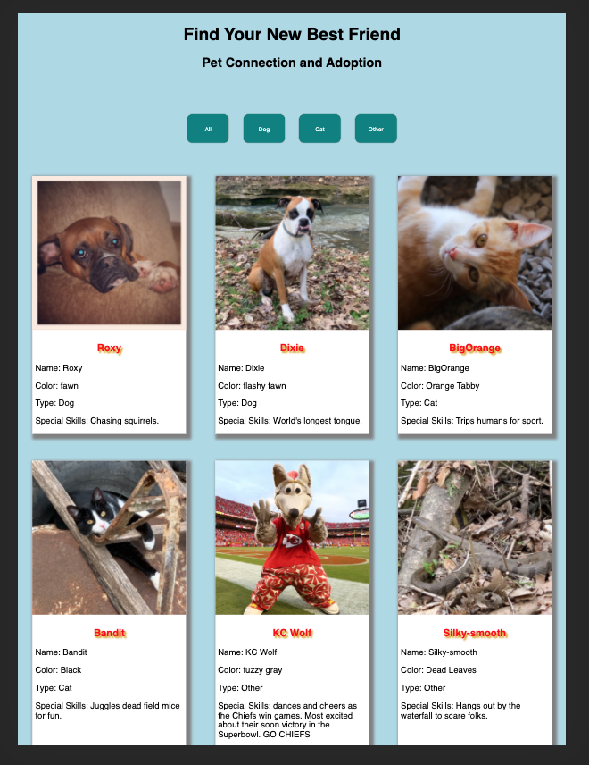
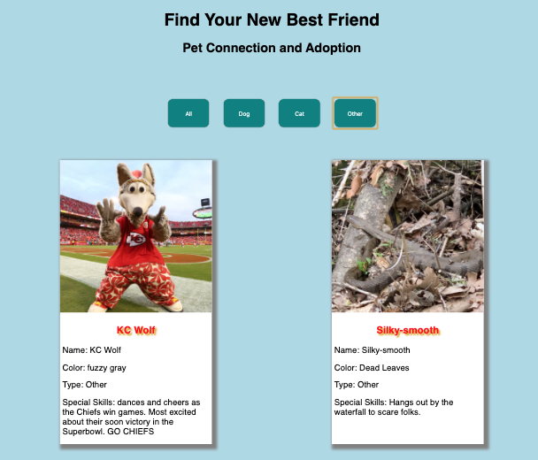

README.md
# Pet Adoption Website
## Description
Find Your New Best Friend is the place to find everlasting friendship in the best kind of way. Adopting a pet. This site uses Javascript and Print To Dom feature that allows a user to update an array and create a dynamic list of future fur/fur-less pals that can be sorted by the user based on preferences. 

## Screenshots

## How to Run
1. Clone this repo
1. Make sure you have http-server installed via npm. If not get it [here](https://www.npmjs.com/package/http-server)
1. On your command line, run `hs -p 9999`
1. In your browser, go to `http://localhost:9999`